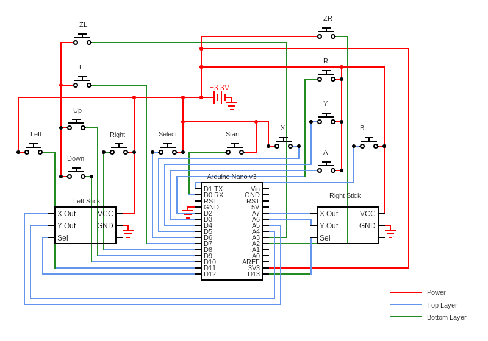
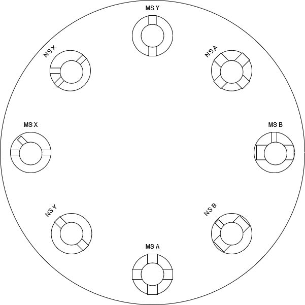

# Game Controller Design Version 1.0

The main idea is to make a PC controller using [Arduino Nano 33 BLE](https://store-usa.arduino.cc/products/arduino-nano-33-ble), [random buttons](https://www.adafruit.com/product/1489) and [analog sticks](https://www.adafruit.com/product/512) based on the designs below.

## Design
### Circuit
  
Exported from [circuit.ccddx](circuit.cddx)

- When the button is closed, the signal goes to high in the digital input to register a press.
- The ZL and ZR buttons are analog while all of the rest of them should be digital.
- Based on the [pinout diagram](../Resources/Arduino%20Nano%2033%20BLE/Pinout-NANOble_latest.pdf), I am connecting the 3.3V and GND to the +ve and -ve ends of the battery to power the Arduino.

### Buttons
  
Exported from [buttons.drawio](buttons.drawio)

- The button holes are meant to be able to be turned 45° clockwise to switch from Xbox layout to Nintendo layout.
- The size of the holes should be different so that even if it looks similar the wrong button shouldn't able to go in the wrong hole.

## Parts
- [Arduino Nano 33 BLE](https://store-usa.arduino.cc/products/arduino-nano-33-ble)
- [Tactile Switch Buttons](https://www.adafruit.com/product/1489)
- [Analog 2-Axis Thumb Joystick with Select Button](https://www.adafruit.com/product/512)

## Tool Used
- [Circuit Diagram Web Editor](https://www.circuit-diagram.org/editor/)
- [diagrams.net](https://app.diagrams.net/)
