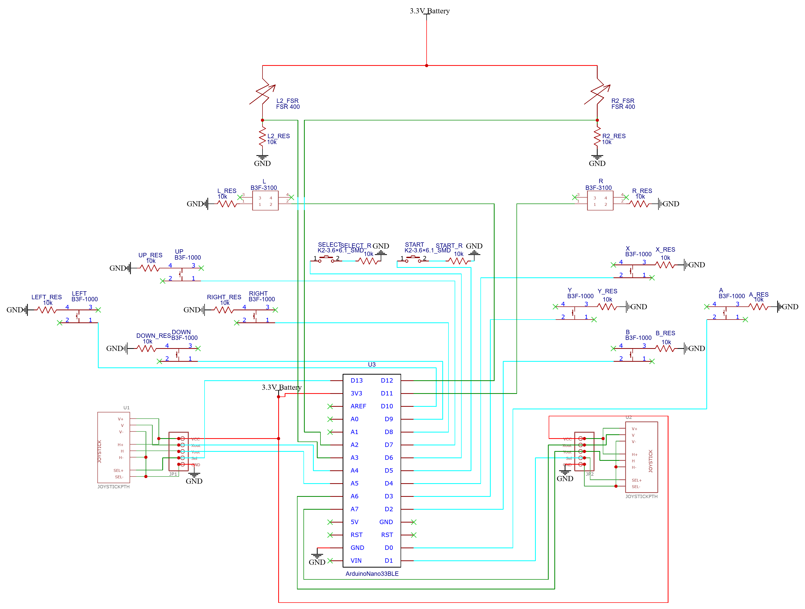

# Game Controller Design Version 1.1

The main idea is to make a PC controller using [Arduino Nano 33 BLE](https://store-usa.arduino.cc/products/arduino-nano-33-ble), [slim buttons](https://www.adafruit.com/product/1489), [tactile buttons](https://www.adafruit.com/product/367), [vertical tactile buttons](https://www.digikey.com/en/products/detail/omron-electronics-inc-emc-div/B3F-3100/368365) and [analog sticks](https://www.adafruit.com/product/512) based on the designs below.

## Design

### Schematic
  
Exported from [schematic.json](schematic.json)

- The Arduino digital pins are put as INPUT_PULLUP so that when the button is closed, the signal goes to low in the digital input to register a press.
- The L2 and R2 buttons are analog while the rest of them should be digital. The L2 and R2 inputs would be using Force-Sensitive Resistors to allows the analog value to change the more the button is pushed. An alternative approach would be to use a potentiometer and turning mechanism when the button is pushed.
- Based on the [Arduino pinout diagram](../Resources/Arduino%20Nano%2033%20BLE/Pinout-NANOble_latest.pdf), I am connecting the 3.3V and GND to the +ve and -ve ends of the battery to power the Arduino.
- A voltage regulator should be put in this schematic.

### PCB
The [PCB](pcb.json) designed from schematic is also included with the [Gerber](Gerber) files. It most likely doesn't follow best practices for routing connections and needs to be tested.
- The intention is that the pads meant for the Arduino line up with the pins on the board and can be used without having to solder it.
- Later work needs to be done to directly connect a nRF52840 microcontroller instead of the whole Arduino board.

### Buttons
  
Exported from [buttons.drawio](../V1.0/buttons.drawio)

- The button holes are meant to be able to be turned 45° clockwise to switch from Nintendo layout to Xbox layout.
- The size of the holes should be different so that even if it looks similar the wrong button shouldn't able to go in the wrong hole.

## Parts
- [Arduino Nano 33 BLE](https://store-usa.arduino.cc/products/arduino-nano-33-ble)
- [Tactile Switch Buttons](https://www.adafruit.com/product/367)
- [Slim Tactile Switch Buttons](https://www.adafruit.com/product/1489)
- [Vertical Tactile Switch Buttons](https://www.digikey.com/en/products/detail/omron-electronics-inc-emc-div/B3F-3100/368365)
- [Analog 2-Axis Thumb Joystick with Select Button](https://www.adafruit.com/product/512)
- [Round Force-Sensitive Resistor](https://www.adafruit.com/product/166)
- [10KΩ Resistors](https://www.adafruit.com/product/2784)

## Tool Used
- [EasyEDA](https://easyeda.com/)
- [diagrams.net](https://app.diagrams.net/)
