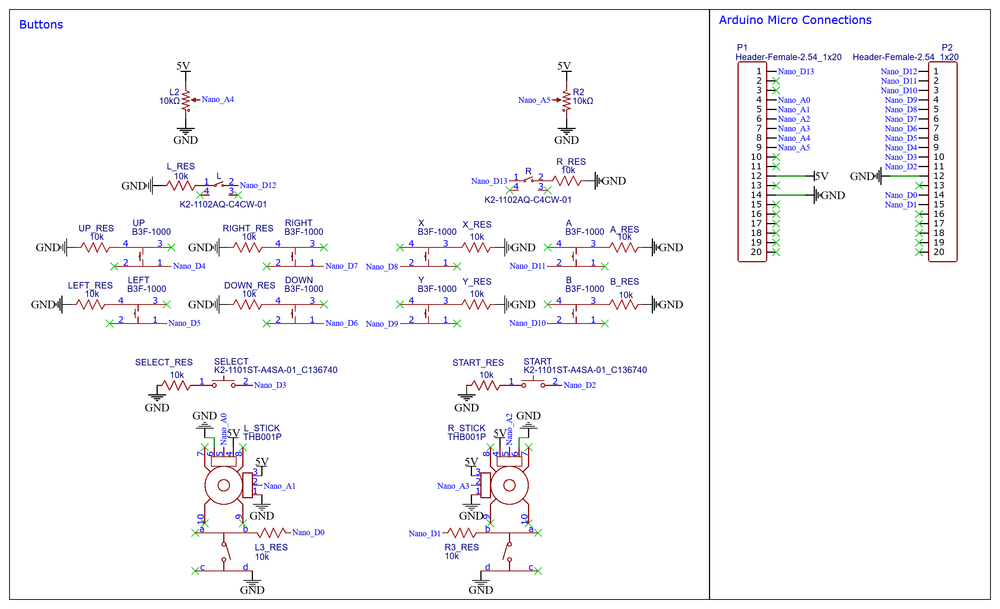

# Game Controller Design Version 2.0

The main idea is to make a PC controller using [Arduino Micro](https://store.arduino.cc/products/arduino-micro), [slim buttons](https://www.adafruit.com/product/1489), [tactile buttons](https://www.adafruit.com/product/367), [vertical tactile buttons](https://www.digikey.com/en/products/detail/omron-electronics-inc-emc-div/B3F-3100/368365) and [analog sticks](https://www.adafruit.com/product/512) based on the designs below.

## Design

### Schematic
  
Exported from [schematic.json](schematic.json)

- The Arduino digital pins are put as INPUT_PULLUP so that when the button is closed, the signal goes to low in the digital input to register a press.
- The L2 and R2 buttons are analog while the rest of them should be digital. The L2 and R2 inputs would be using potentiometers which will require a turning mechanism when the button is pushed.

### PCB
The [PCB](pcb.json) designed from schematic is also included with the [Gerber](Gerber) files. It most likely doesn't follow best practices for routing connections but has been tested and does work.
- The intention is that the female headers allow for the Arduino to be attacched to the board without having to solder it.
- Later work needs to be done to directly connect the Arduino's microcontroller directly instead of the whole Arduino board.

### Buttons
  
Exported from [buttons.drawio](../V1.0/buttons.drawio)

- The button holes are meant to be able to be turned 45° clockwise to switch from Nintendo layout to Xbox layout.
- The size of the holes should be different so that even if it looks similar the wrong button shouldn't able to go in the wrong hole.

## Code
Use [Matthew Heironimus'](https://github.com/MHeironimus) [Arduino Joystick Library](https://github.com/MHeironimus/ArduinoJoystickLibrary) to make [the Arduino Sketch](code/code.ino) that will act as the firmware for the controller.

## Parts
- [Arduino Micro](https://store.arduino.cc/products/arduino-micro)
- [Tactile Switch Buttons](https://www.adafruit.com/product/367)
- [Slim Tactile Switch Buttons](https://www.adafruit.com/product/1489)
- [Vertical Tactile Switch Buttons](https://www.digikey.com/en/products/detail/omron-electronics-inc-emc-div/B3F-3100/368365)
- [Analog 2-Axis Thumb Joystick with Select Button](https://www.adafruit.com/product/512)
- [10KΩ Resistors](https://www.adafruit.com/product/2784)
- [10KΩ Potentiometer](https://www.adafruit.com/product/356)

## Tool Used
- [EasyEDA](https://easyeda.com/)
- [diagrams.net](https://app.diagrams.net/)
- [Arduino IDE](https://www.arduino.cc/en/software)
